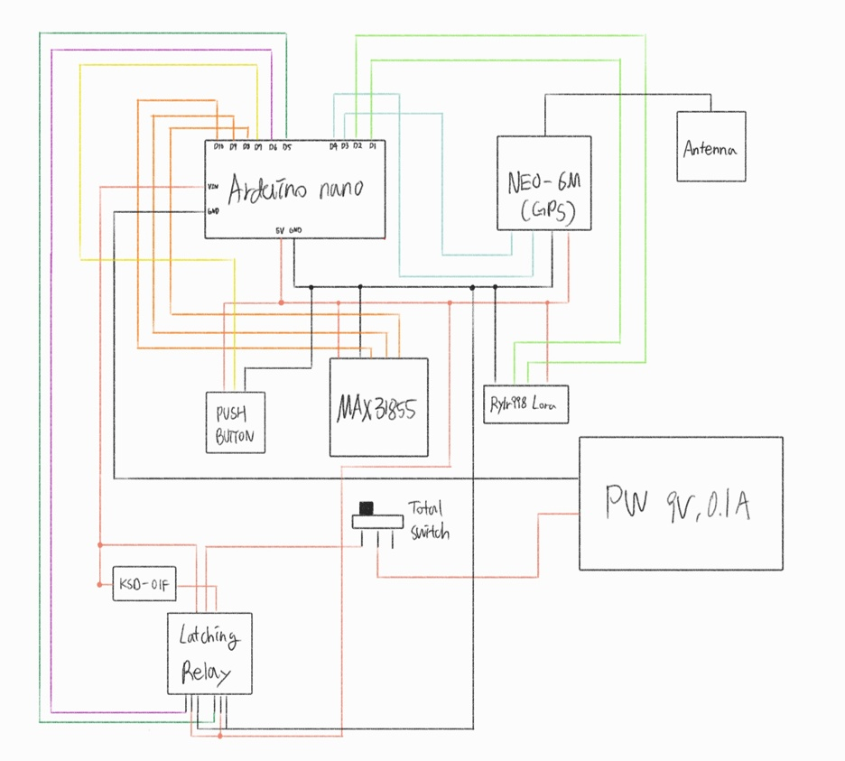
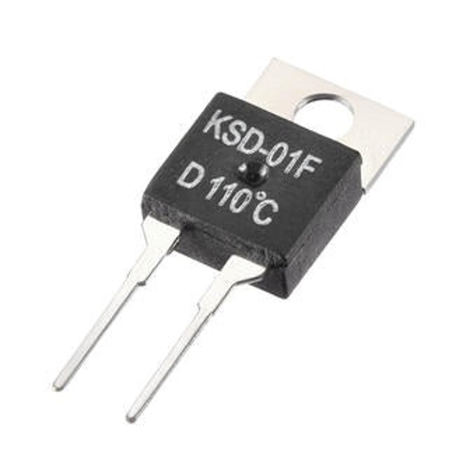

# 🛰️ 불 조기 감지 및 확산 예측을 위한 GPS 캡슐 설계 (새로)
> **2025 인하 종합설계 경진대회 대상 & ICT 한이음 장관상 수상작** > 산불 초기 감지 및 위치 정확도 보정을 위한 저전력·장거리 반영구 소방 감시 캡슐 시스템입니다.

---

## 📅 Project Timeline
- **진행 기간**: 2025년 3월 ~ 2025년 10월

---

## 📺 Project Media
- **최종 구현 및 구동 영상**: [YouTube 링크](https://youtu.be/L54U7Y6tGTQ?si=f3Mb1i5vw0KDZKQF)

---

## 👥 Team Members & Roles
| 이름 | 학과 | 역할 | 담당 업무 |
| :---: | :---: | :---: | :--- |
| **김소희** | 기계공학과 & 전기전자공학부 | **팀장** | 프로젝트 총괄, 하드웨어 배선, MCU 인터럽트 처리 및 펌웨어 코딩 |
| **서자영** | 기계공학과 | 팀원 | 하드웨어 및 내·외부 이중 캡슐 구조 설계 |
| **박준혁** | 기계공학과 | 팀원 | 펌웨어 코딩 |
| **강수영** | 기계공학과 | 팀원 | 난연 소재 분석 및 외장재 코팅(난연/방수) 실험 |

---

## 🛠️ Hardware Connection & Circuit Diagram

### [회로 배선도]


### [주요 제어 하드웨어]
- **MCU <-> MAX31855**: SPI 통신 기반 온도 데이터 수집
- **MCU <-> NEO-6M (GPS)**: UART 통신 및 칼만 필터 보정 연산
- **MCU <-> Reyax RYLR898 (LoRa)**: 저전력 장거리 패킷 데이터 전송
- **KSD-01F 바이메탈 열 스위치**: 화재 시 시스템을 깨우는 무전원 트리거 장치 ($110^\circ\text{C}$ 동작 형)



---

## ⚙️ System Operation (전체 구동 방식)

본 시스템은 산불 감시 지역에 상시 배치 시 대기 전력을 완벽히 차단하는 **슬립 모드(Slip Mode)** 메커니즘을 기반으로 작동하며, 장치 셋업과 화재 감지 시 각각 다음과 같이 유기적으로 구동됩니다.

### 1. 초기 하드웨어 셋업 (푸쉬 버튼 제어)
장치를 현장에 배치하거나 초기 구동 시, 외부에 노출된 **푸쉬 버튼(Push Button)**을 통해 장치의 초기 기준 위치 데이터를 구축합니다.
1. 사용자가 **푸쉬 버튼**을 누릅니다.
2. 시스템이 깨어나 **GPS를 작동**시킵니다.
3. 현재 위치를 정밀 측정 후, 칼만 필터(Kalman Filter)를 거쳐 **위치 오차를 보정**합니다.
4. 보정 완료된 초기 기준 위치값을 **내부 EEPROM 메모리에 안전하게 저장**합니다.
5. 저장 완료 후 **래칭 릴레이(Latching Relay)에 신호**를 보내 장치를 완벽한 대기(슬립) 상태로 전환합니다.

### 2. 평상시 상태 (슬립 모드)
- 장치가 현장에 정상 배치되면 **전류가 전혀 흐르지 않는 슬립 모드(Sleep Mode)**를 유지합니다.
- 불필요한 배터리 소모를 완전 차단함으로써 추가 전원 공급 없이도 장기간 야외에서 반영구적 감시 임무를 수행할 수 있습니다.

### 3. 화재 발생 시 (열 스위치 트리거 작동)
1. 산불이 발생하여 주위 온도가 스위치 동작 온도($110^\circ\text{C}$)에 도달하면, **KSD01F 바이메탈 열 스위치**가 자동으로 접합(ON)됩니다.
2. 전류가 공급되며 즉시 **슬립 모드가 OFF(Wake-up)**됩니다.
3. MCU가 깨어남과 동시에 **현재 주변 온도 측정** 및 GPS 연산을 통해 **현재 위치를 추적**합니다.
4. EEPROM에서 초기 위치 데이터를 빠르게 불러와 **칼만 필터(Kalman Filter)** 연산을 초고속으로 수렴시키고 위치 노이즈를 잡습니다.
5. 획득한 고신뢰성의 온도 및 위치 데이터를 **LoRa 통신을 통해 메인 컴퓨터(중앙 서버)로 즉각 송신**합니다.
6. 관제 시스템에서 실시간으로 화재 발생 신호 및 위치 정보를 확인하여 정밀한 산불 확산 예측을 시작합니다.

---

## 🚀 Key Features & Technologies

### Software Algorithms
- **잡음 제거를 위한 칼만 필터(Kalman Filter) 적용**
  - GPS 단독 측위 시 발생하는 오차($\pm10\text{m}$ 이상)를 보정하기 위해 예측(Prediction) 및 갱신(Update) 알고리즘 적용
  - 상태 예측 공식:
    $$\hat{x}_{k}^{-} = A\hat{x}_{k-1} + Bu_{k}$$
  - 오차 공분산 예측 공식:
    $$P_{k}^{-} = AP_{k-1}A^{T} + Q$$
- **EEPROM 활용 필터 고속화**
  - 칼만 필터의 초기값 설정이 수렴 속도에 미치는 영향을 고려하여, 센서의 초기 위치값을 **EEPROM에 저장하고 구동 시 로드**하는 방식 적용 (시스템 안정화 시간 대폭 단축)

### Structure & Power
- **Power**: 산불 환경에서의 화재 위험성을 방지하기 위해 리튬 폴리머 전지 대신 **AA 건전지 직렬 배치**로 안정적인 전압·전류 공급
- **Structure**: 최대 1200°C의 화염에 대응하기 위해 **난연 PLA 필라멘트(UL94 V-0)** + **인튬선트 난연 코팅** + **실리콘 방수 코팅** 기반의 **내·외부 이중 캡슐 구조** 채택

---

## 📂 Repository Structure
```text
├── src/
│   ├── main.ino            # 아두이노/MCU 메인 소스 코드
│   ├── kalman_filter.h      # 칼만 필터 알고리즘 및 EEPROM 로직
│   └── lora_transmitter.h   # LoRa 데이터 전송 프로토콜
├── docs/
│   ├── 2025_종합설계경진대회_최종보고서.pdf
│   └── presentation_slides.pdf
├── image_587d39.jpg        # 회로 배선도 이미지
├── image_588024.png        # KSD-01F 열 스위치 부품 이미지
└── README.md
