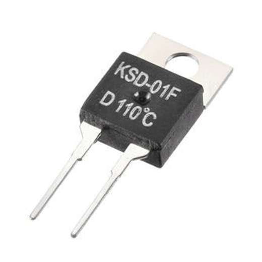
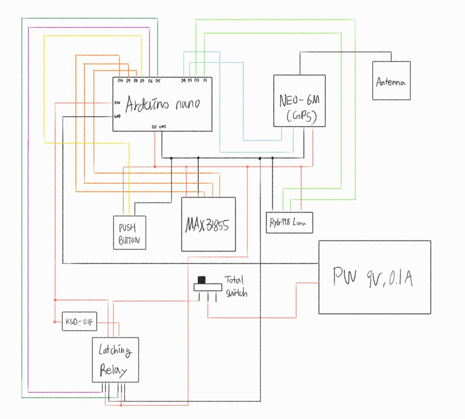

# SAERO Fire Capsule

산림에 배치한 캡슐이 열 스위치로 화재를 감지하면 온도와 GPS 위치를 LoRa로 전달하는 개념 설계 프로젝트다. 이 저장소에는 회로 구상, 캡슐 구조 자료와 Arduino 펌웨어 프로토타입이 포함되어 있다.



## 동작 개념

1. 배치 시 버튼을 눌러 GPS 기준 위치를 EEPROM에 저장한다.
2. 래칭 릴레이로 주 회로 전원을 차단한다.
3. 열 스위치가 작동하면 전원이 복귀한다.
4. 저장 위치를 먼저 전송하고, 이후 GPS 측정값을 1차원 Kalman filter로 보정한다.
5. RYLR898 LoRa AT 명령으로 위치·온도 패킷을 송신한다.

```text
FIRE_ALERT,<latitude>,<longitude>,<temperature>
```

## 하드웨어 구성안

| 부품 | 용도 |
|---|---|
| Arduino Nano | 상태 처리와 데이터 송신 |
| KSD-01F | 온도 임계 접점 |
| MAX31855 + K-type 열전대 | 온도 측정 |
| GPS 모듈 | 위치 측정 |
| RYLR898 | LoRa 통신 |
| 래칭 릴레이 | 배치 후 전원 차단 |



## 코드 구성

```text
src/main.ino           배치·화재 이벤트 상태 흐름
src/kalman_filter.h    위도·경도 독립 1차 Kalman filter
src/lora_transmitter.h RYLR898 초기화와 AT+SEND 송신
docs/                  최종 보고서와 발표자료
```

RYLR898 배선은 모듈 TX → Arduino D4, 모듈 RX → Arduino D1로 정의되어 있다.

## 구현 상태

현재 코드는 **하드웨어 통합 전 펌웨어 프로토타입**이다. LoRa 송신 함수와 Kalman filter는 구현되어 있지만 GPS와 MAX31855 읽기는 고정 샘플값을 반환하는 stub이다. 따라서 실제 화재 감지 성능, 고온 내구성, 통신 거리, 위치 정확도와 전원 복귀 신뢰성은 검증된 수치가 아니다.

실장 단계에서는 실제 GPS·MAX31855 드라이버 연결, D1 하드웨어 Serial과 SoftwareSerial 충돌 해소, 센서·릴레이·LoRa 통합 시험, 고온 차폐 시험과 배터리 수명 측정이 필요하다.

프로젝트 배경과 설계안은 [최종 보고서](docs/2025%20종합설계경진대회%20최종보고서%5B새로%5D.pdf) 및 [발표자료](docs/새로%20발표자료.pdf)에 정리되어 있다.
